### Ошибка 1 — Создание объекта IndexDict не через create-метод
Место: `Library.py`, метод `__init__`

Симптом:
Не создается объект IndexDict, так как `__init__` ожидает 3 словаря, а `create` - BookCollection

Как воспроизвести:
Запустить симуляцию.

Отладка:
Установлен breakpoint на инициализацию индекса библиотеки.
В отладчике видно, что `__init__` ожидает 3 аргумента, а подан 1.

Причина:
Не использован create-метод, который индексирует BookCollection, а потом вызывает `__init__`.

Исправление:
Заменено на:
self.IdxDict = IndexDict.create(self.BookColl)

Проверка:
Поведение симуляции соответствует ожидаемому.

Доказательства:
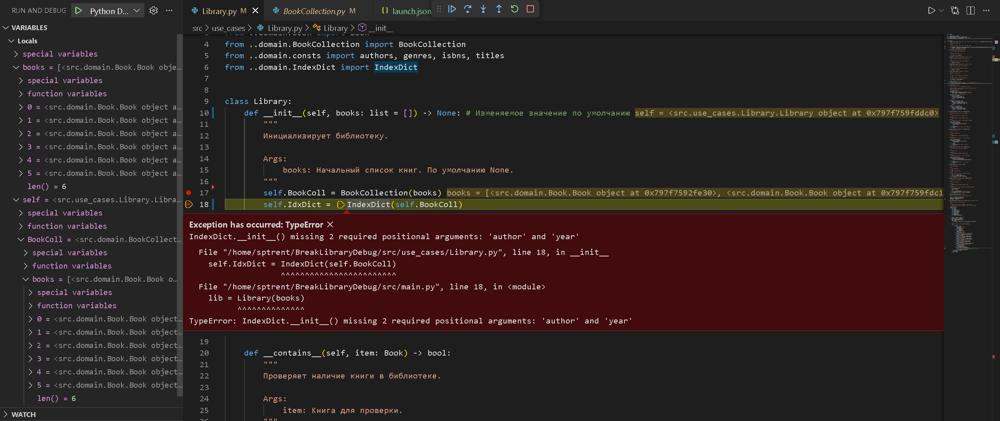
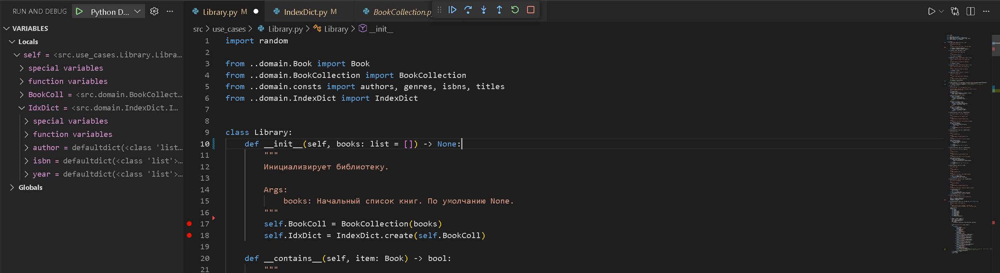

---

### Ошибка 2 — неверное логическое условие
Место: `IndexDict.py`, метод `create`

Симптом:
Заполнение индекса происходит тогда, когда `source` это `None`, то есть ничего не передано.

Как воспроизвести:
Запустить симуляцию.

Отладка:
Установлен breakpoint на условие if.
В отладчике видно, что `source` это список, но индекс не заполняется.

Причина:
Использовано неверное логическое условие (`is None`).

Исправление:
Заменено на:
if event `is not None`:

Проверка:
Поведение симуляции соответствует ожидаемому.

Доказательства:
До условия:
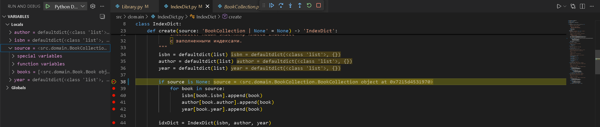
После условия (BookCollection не проиндексирована):
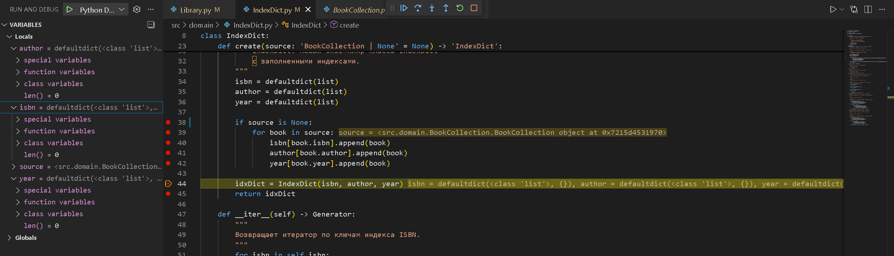

---

### Ошибка 3 — return вместо yield в методе `__iter__`
Место: `BookCollection.py`, метод `__init__`

Симптом:
Программа падает при переборе BookCollection через цикл for, так как `__iter__` возвращает книгу, а не генератор

Как воспроизвести:
Запустить симуляцию.

Отладка:
Установлен breakpoint на метод `__iter__`.
В отладчике видно, цикл for ожидает генератор от `__iter__`, а получает книгу.

Причина:
Не использован create-метод, который индексирует BookCollection, а потом вызывает __init__.

Исправление:
Заменено на:
yield book

Проверка:
Поведение симуляции соответствует ожидаемому.

Доказательства:
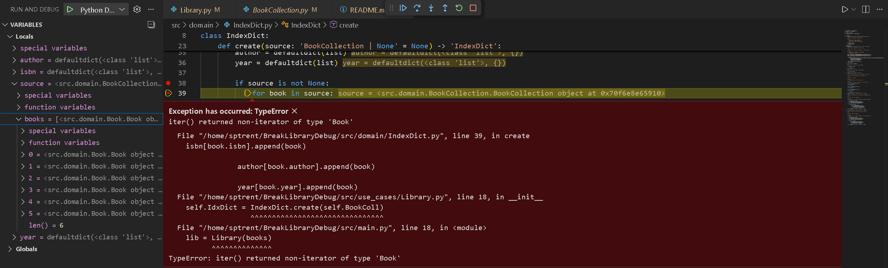
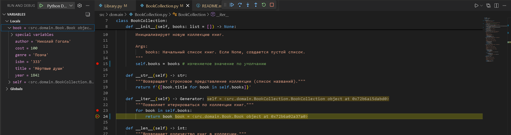

---

### Ошибка 4 — вывод неверной информации в консоль
Место: `Library.py`, метод `run_simulation` case `randomly_change_genre`

Симптом:
на каждой итерации генерирую книгу, вывожу, что поменял ее жанр, хотя на самом деле
в методе `randomly_change_genre` выбираю случайную книгу из self.BookColl и меняю ей жанр

Как воспроизвести:
Запустить симуляцию с seed = 20, законментировав методы поиска в actions.

Отладка:
Установлен breakpoint на метод `randomly_change_genre` и case `randomly_change_genre` в методе `run_simulation`.

В отладчике видно, что выведена строка "Поменял жанр Игры с реальностью", хотя в методе `randomly_change_genre`
выбрал книгу "Сигнал из тишины" и поменял ей жанр.

Причина:
Неправильный print.

Исправление:
print перенесен в метод `randomly_change_genre`

Проверка:
Поведение симуляции соответствует ожидаемому.

Доказательства:
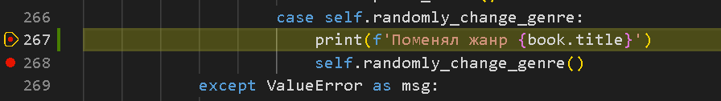
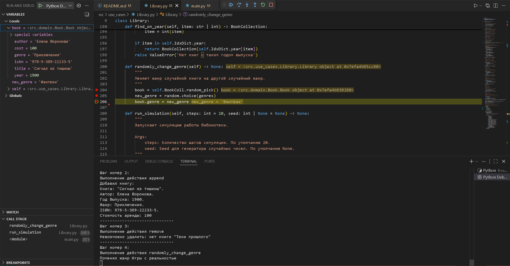

---

### Ошибка 5 — лишние книги при создании библиотеки
Место: `BookCollection.py`, метод `__init__`

Симптом:
в main.py создал lib1 через Library(), добавил туда 1 книгу, создал lib2 через Library()
и в ней сразу появилась та же книга, что в lib1

Как воспроизвести:
```
lib1 = Library()
lib1.append(Book('Мёртвые души', 'Николай Гоголь', 1842, 'Поэма', '333'))
lib2 = Library()
print(len(lib2.BookColl))
```

Отладка:
Установлен breakpoint на метод `__init__`.

В отладчике видно, что при инициализации lib1 и lib2 у них общий список books по умолчанию
поэтому при инициализации lib2 в нем уже есть книга из lib1

Причина:
Изменяемое значение по умолчанию.

Исправление:
```
class BookCollection:
    def __init__(self, books: list | None = []) -> None:
        self.books = books if books is not None else []
```

Проверка:
запустить тот же main, убедиться, что теперь длина lib2.BookColl = 0.

Доказательства:
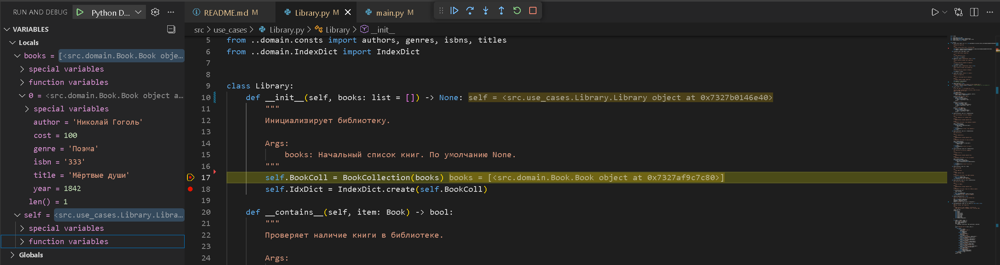

Такая же ошибка могла бы быть в IndexDict или Library.

### Ошибка 6 — отстутсвие `return self` в `__add__`
Место: `Library.py`, метод `__add__`

Симптом:
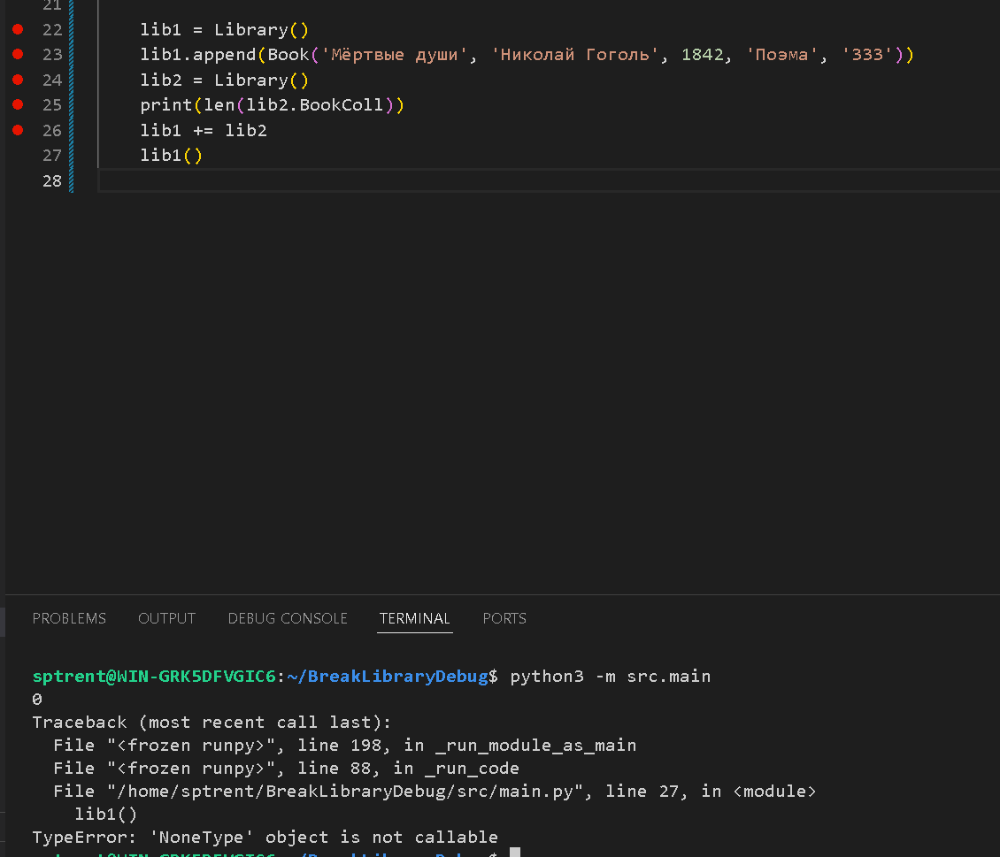

Как воспроизвести:
```
lib1 = Library()
lib1.append(Book('Мёртвые души', 'Николай Гоголь', 1842, 'Поэма', '333'))
lib2 = Library()
lib1 += lib2
lib1()
```

Отладка:
Установлен breakpoint на строку `lib1()`.

В отладчике видно, после метода `__add__` lib1 принимает значение None, значит
он не возвращает значение

Причина:
Нет `return self` для использования +=.

Исправление:
добавить `return self`

Проверка:
запустить тот же main, убедиться, что выводиться информация о lib1.

Доказательства:
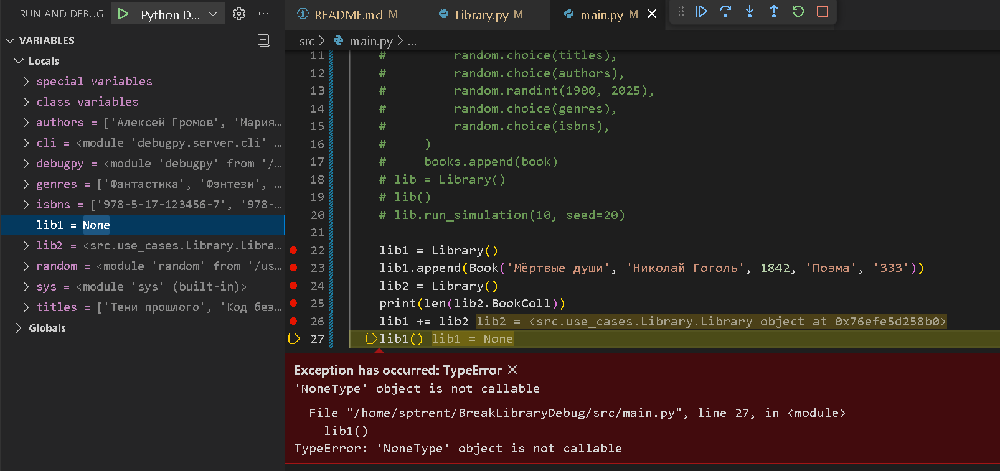
